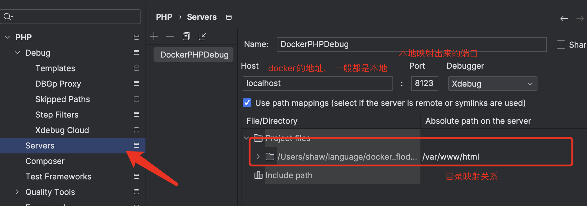
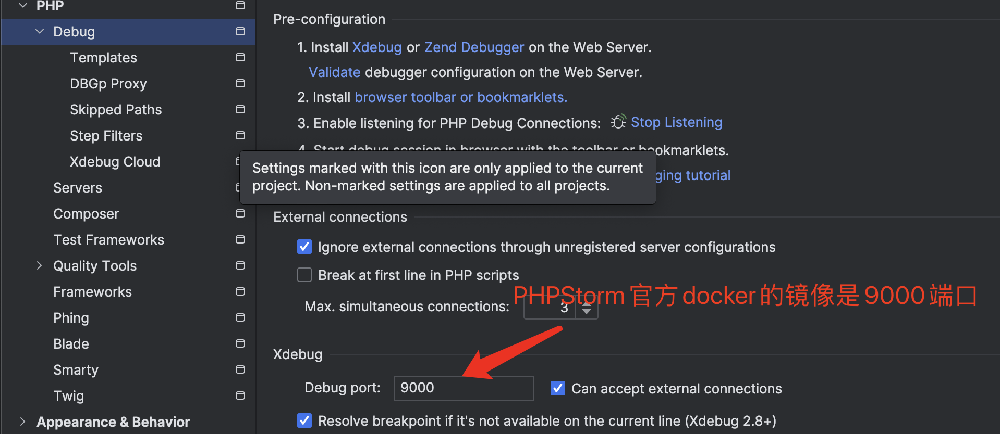
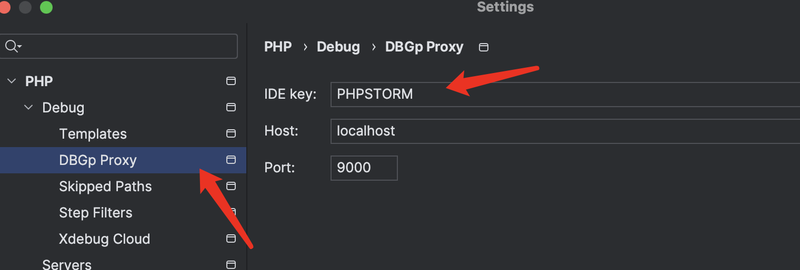
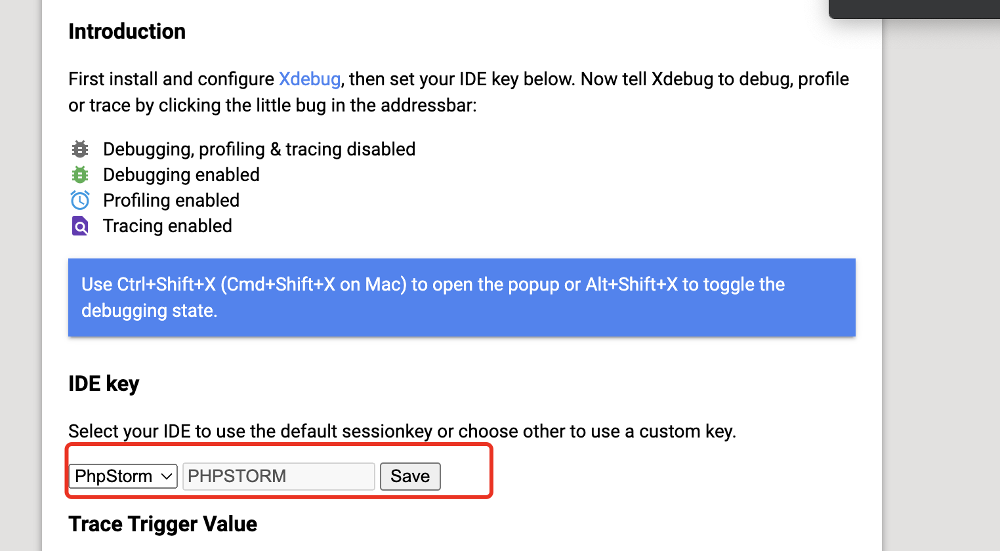
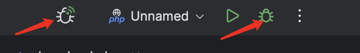
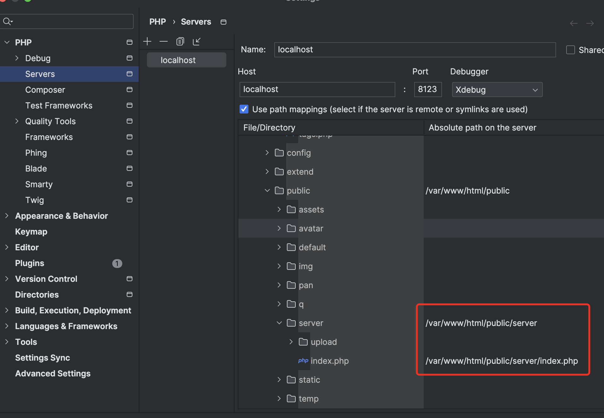

## 使用

将要调试的代码放到 `source/src` 目录下，在`source/Dockerfile` 中选择对应版本的php就行了. 

## PHPStorm 环境配置

**`IDE key` 得和 `xdebug Helper`的一致**

设置完之后

打开`xdebug` ，调试就行了

**关于部分时候断点调试捕获不了的问题：**

临时解决方案：在 `Setting----->PHP---->servers` 处的映射路径多填写一点.具体原因还在排查.

## 数据库监控

数据库监控我使用的这个项目：https://github.com/ac0d3r/MySQLMonitor, 监控原理是去获取general_log_file

### Todo

- [ ] 等待 Mysql 启动.